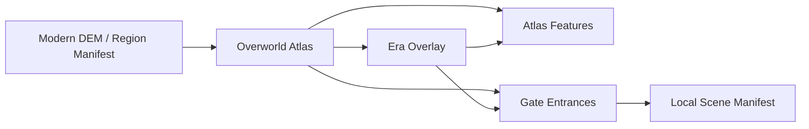

# 多尺度地图与历史年代层架构设计

日期：2026-05-01

## 背景

当前项目的 `秦岭 - 关中 - 汉中 - 四川盆地` 地图已经不只是小型关卡，而更接近一个区域级总览地图。用户希望它未来像《33 号远征队》那样承担大地图功能：玩家在总览地图上移动，靠近特定入口后进入更细分、更高密度的局部场景。

同时，中国历史地理在不同时代存在显著变化。河道、湖泽、关隘位置、城市意义、道路通达性都会改变军事、人文和民生解释。因此架构要预留“历史年代地图”能力。但近期仍以现代地形为基础，不立即填充完整历史内容。

## 设计目标

- 当前秦岭尺度地图定位为 `Overworld Atlas`，负责宏观地貌、道路、水系、城市、关隘和入口浏览。
- 入口节点定位为 `Gate Entrance`，负责提示玩家可以进入更细分场景。
- 局部场景定位为 `Local Scene`，负责更高细节密度、更强叙事和更具体的 3D 体验。
- 历史年代能力定位为 `Era Overlay`，先定义数据契约，不在当前阶段填充大量内容。
- 现代地形和现代基础水系仍是近期唯一落地基准层。

## 非目标

- 不在当前阶段制作完整中国历史地图数据库。
- 不在当前阶段为每个朝代生成一套独立 3D DEM。
- 不把现有秦岭切片拆成多个真实可进入局部场景。
- 不为了历史时代层牺牲当前现代基础 Atlas、水系和 POI 的推进节奏。

## 核心模型

### 1. Overworld Atlas

`Overworld Atlas` 是区域级总览地图。当前秦岭切片就是第一张 Overworld。

职责：

- 展示宏观地貌：平原、主脊、盆地、峡门、河谷。
- 展示现代基础水系、城市、古道、关隘、军事、民生、人文图层。
- 承载玩家在区域尺度上的移动和探索。
- 呈现可进入的 Gate Entrance。
- 提供地图缩放、拖拽、图层筛选、POI 查询和开发校对。

### 2. Gate Entrance

`Gate Entrance` 是从总览地图进入局部场景的入口节点。它像游戏里的“门”，但语义上是地理叙事入口。

典型入口：

- 关中平原入口。
- 陈仓道入口。
- 褒斜谷入口。
- 子午谷入口。
- 剑门关入口。
- 汉中盆地入口。
- 函谷关入口。

入口节点应包含：

- `id`：稳定入口 ID。
- `name`：显示名称。
- `world`：严格世界坐标。
- `targetSceneId`：未来局部场景 ID。
- `entryType`：如 `plain`、`road`、`pass`、`basin`、`city`。
- `summary`：为什么这里值得进入。
- `availability`：当前是否可进入。近期可以是 `stub`，只展示提示，不切场景。

### 3. Local Scene

`Local Scene` 是更高细节的限定地图，不要求与 Overworld 使用同一套网格密度。

职责：

- 在较小范围内提高地形、建筑、植被、道路、人物事件和 POI 密度。
- 支持更细的故事、任务和交互。
- 从 Overworld 的 Gate Entrance 进入。
- 完成后返回 Overworld，并保留玩家进度。

近期只定义 `Local Scene Manifest` 结构，不填充真实场景。

### 4. Era Overlay

`Era Overlay` 是历史年代叠加层。它不是替换现代 DEM 的第一优先方案，而是在现代基础地理上叠加历史要素。

适合表达：

- 云梦泽等古湖泽/湿地范围。
- 黄河改道。
- 古今函谷关、潼关等关隘位置变化。
- 古道路、驿道、栈道、漕运线。
- 古城、遗址、战场、都城范围。
- 历史时期的可通行性、军事意义和聚落密度。

数据字段建议：

- `eraId`：如 `modern`、`warring-states`、`qin-han`、`three-kingdoms`、`tang`、`song`、`ming-qing`。
- `label`：显示名称。
- `baseTerrainPolicy`：近期固定为 `modern-dem-with-overlay`。
- `features`：该时代启用的 overlay features。
- `confidence`：`high`、`medium`、`low`。
- `sourceNote`：资料说明，允许先写概述，不冒充精确史料。

## 推荐架构

近期采用：

`Modern Base Terrain -> Overworld Atlas -> Gate Entrance stubs -> Future Local Scene -> Future Era Overlay`

原因：

- 现代 DEM 已经接入，继续推进现代基础层最稳。
- Gate Entrance 可以立刻改善“总览地图像游戏世界”的体验，即使暂时不能进入真实局部场景。
- Era Overlay 先做契约，不消耗大量内容制作成本。
- 未来可以对重点历史变化区域做局部补丁，而不是为所有时代复制完整 DEM。

## 数据关系

## 近期落地切片

第一阶段只做架构可见性：

- 在 Atlas feature schema 中预留 `gate` 类 feature。
- 在秦岭 Atlas 中加入少量入口节点，但 `availability` 设为 `stub`。
- 信息卡显示“未来可进入局部场景”，不切换运行时场景。
- 文档中定义 era overlay schema，但默认 `modern`，不切换时代。

## 验收标准

- 文档明确现代地形是近期基础层。
- 文档明确历史年代能力是未来 overlay，不是当前内容填充任务。
- 任务看板中出现多尺度地图和年代层任务，但不会替代当前 Atlas 缩放、水系和 POI 工作。
- 未来实现 Gate Entrance 时，不需要推翻现有 region manifest、Atlas feature 和严格坐标原则。

## 自检

- 没有要求现在填充完整历史内容。
- 没有要求现在生成多个局部场景。
- 没有引入与严格地理坐标冲突的地图变形策略。
- 历史年代层明确以现代 DEM 为基础，未来再按重点区域补丁增强。
